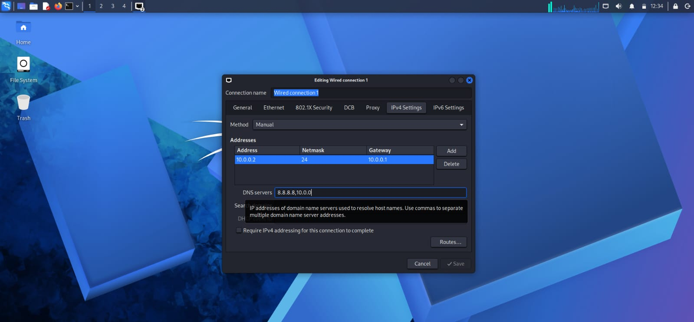
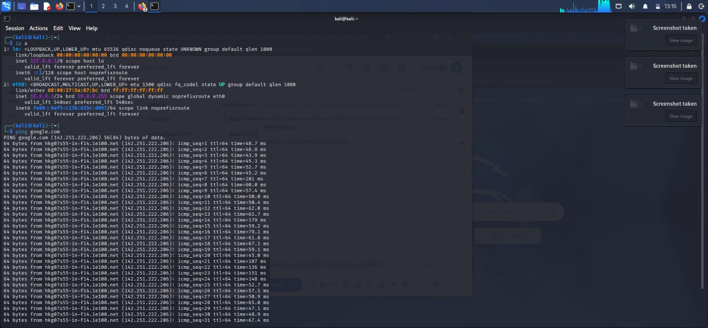
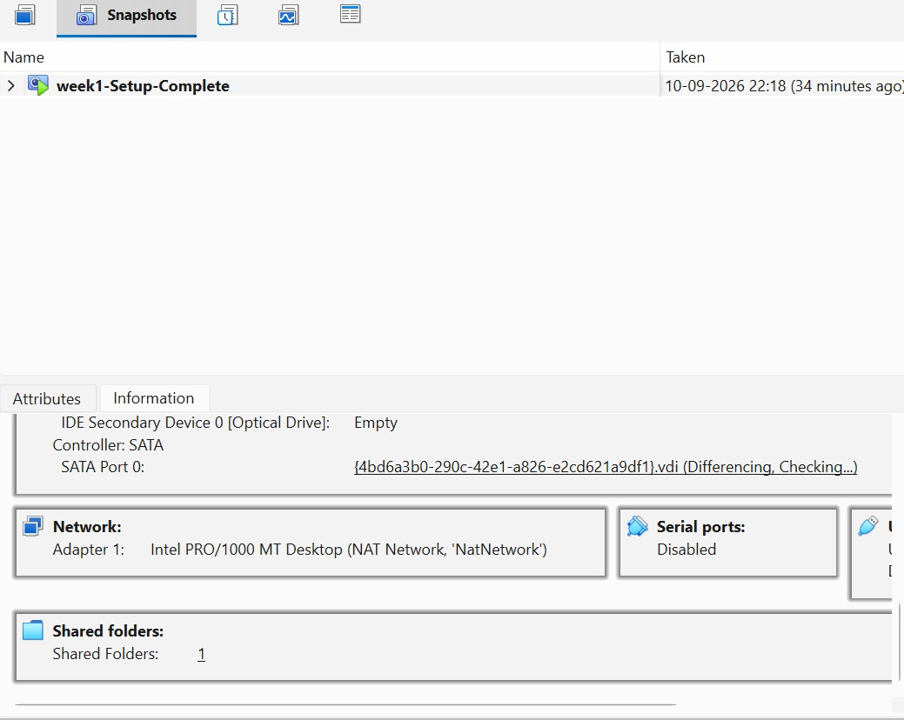
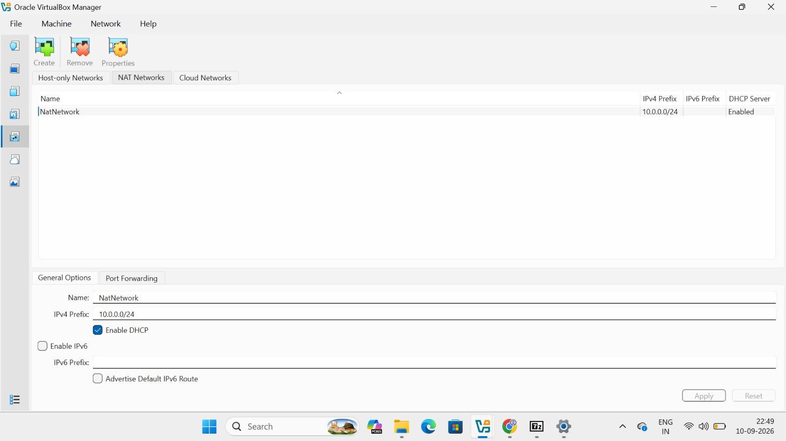

Kali Linux Network Setup Lab 📌

**Project Overview**

This project documents my Week 1 Kali Linux networking lab using Oracle VirtualBox.

The main objective was to configure the Kali Linux virtual machine network, assign an IPv4 address, configure DNS, and verify internet connectivity.

**Tools Used**

Kali Linux  
Oracle VirtualBox  
NetworkManager (nmcli)  
Linux Networking Commands  
Google DNS (8.8.8.8)

**Network Configuration**

| Setting | Value |
|---|---|
| Virtualization Software | Oracle VirtualBox |
| Network Mode | NAT Network |
| NAT Network Name | NatNetwork |
| IPv4 Network | 10.0.0.0/24 |
| Kali Linux IP Address | 10.0.0.2/24 |
| Gateway | 10.0.0.1 |
| DNS Server | 8.8.8.8 |
| Network Interface | eth0 |

**Tasks Completed**

Created and configured a NAT Network in VirtualBox

Checked the network interface using `ip addr`

Checked device status using `nmcli device status`

Viewed the available network connection

Configured a manual IPv4 address

Configured the gateway and DNS server

Activated the wired connection

Verified internet connectivity using `ping google.com`

Created a VirtualBox snapshot named `week1-Setup-Complete`

**Lab Screenshots**

**Checking Network Interfaces**

Checked the available network interfaces using the `ip addr` command.

**Checking NetworkManager Device Status**

Checked the NetworkManager device status using `nmcli device status`.

**Configuring the Wired Connection**

Configured the wired network connection with the required IPv4 address, gateway, and DNS settings.

**VirtualBox NAT Network Configuration**

Configured the NAT Network in Oracle VirtualBox.

**Successful Internet Connectivity Test**

Verified internet connectivity using the `ping google.com` command.

**Result**

The Kali Linux virtual machine was successfully configured with a NAT Network and a manual IPv4 configuration.

Internet connectivity was successfully verified using the `ping` command.

**Learning Outcomes**

Basic Linux network troubleshooting

Configuring network connections using `nmcli`

IPv4 addressing and gateway configuration

DNS configuration

Network verification using `ping`

Configuring NAT Network in Oracle VirtualBox

Managing VirtualBox snapshots
